# Employee Database: A Mystery in Two Parts

## Background
This project is to demonstrate data engineering and analysis skills learned from the previous sessions. Data of the Employees at Pewlett Hackard Corperation from 1980s and 1990s. The dataset is provided in `CSV` format. In this project, a database was created in `Postgres`. The data from `CSV` files were imported into tables in the database. 

The task is to perform data engineering and data analysis as follow:
### Data Modeling
From the completed tables in the database, an ERD of the tables was created using [`http://www.quickdatabasediagrams.com`](https://www.quickdatabasediagrams.com) as a tool. \
Below is the ERD of this datasets:

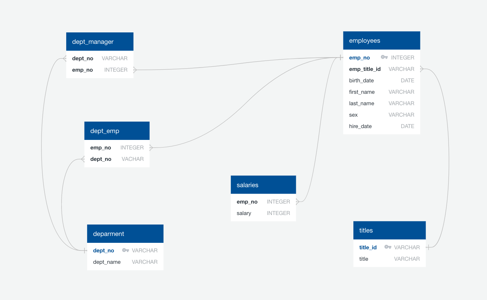

### Data Engineering
The schema of six `CSV` files were constructed in `Postgresql`. In each schema, data types was defined and primary and foreign keys were also assigned. The schema `SQL` file could be linked to [employee_database.sql](https://github.com/KeSavanh/sql-challenge/blob/main/EmployeeSQL/employee_database.sql)
### Data Analysis
The analysis was performed using `Postgresql` by creating queries to extract data from the tables in the database. The queries were saved in [data_queries.sql](https://github.com/KeSavanh/sql-challenge/blob/main/EmployeeSQL/data_queries.sql):
1. List the following details of each employee: employee number, last name, first name, sex, and salary.
```
SELECT e.emp_no AS "employee number", e.last_name AS "last name", e.first_name AS "first name", e.sex, s.salary
FROM employees AS e
JOIN salaries AS s
ON e.emp_no = s.emp_no;
```

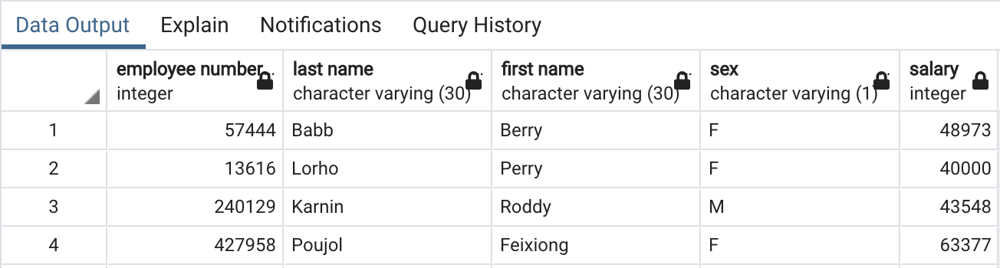

2. List first name, last name, and hire date for employees who were hired in 1986.
```
SELECT first_name AS "first name", last_name AS "last name", hire_date AS "hired date"
FROM employees
WHERE EXTRACT (YEAR FROM hire_date) = 1986;
```
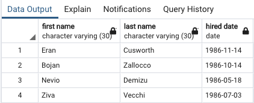

3. List the manager of each department with the following information: department number, department name, the manager's employee number, last name, first name.
```
SELECT d.dept_no AS "department number", d.dept_name AS "department name", dm.emp_no AS "manager employee number", e.first_name AS "first name", e.last_name AS "last name"
FROM departments AS d
JOIN dept_manager AS dm
ON d.dept_no = dm.dept_no
JOIN employees AS e
ON dm.emp_no = e.emp_no;
```
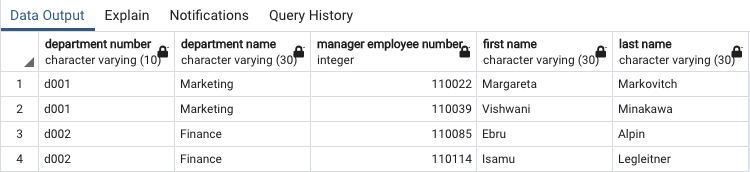

4. List the department of each employee with the following information: employee number, last name, first name, and department name.
```
SELECT e.first_name AS "first name", e.last_name AS "last name", d.dept_name AS "department name"
FROM employees AS e
JOIN dept_emp AS dm
ON e.emp_no = dm.emp_no
JOIN departments AS d
ON dm.dept_no = d.dept_no;
```
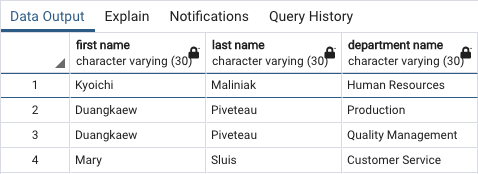

5. List first name, last name, and sex for employees whose first name is "Hercules" and last names begin with "B".
```
SELECT first_name AS "first name", last_name AS "last name", sex
FROM employees
WHERE first_name = 'Hercules' AND last_name LIKE 'B%';
```
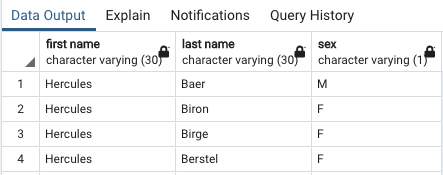

6. List all employees in the Sales department, including their employee number, last name, first name, and department name.
```
SELECT e.first_name AS "first name", e.last_name AS "last name", d.dept_name AS "department name"
FROM employees AS e
JOIN dept_emp AS de
ON e.emp_no= de.emp_no
JOIN departments AS d
ON de.dept_no= d.dept_no
WHERE d.dept_name ='Sales';
```
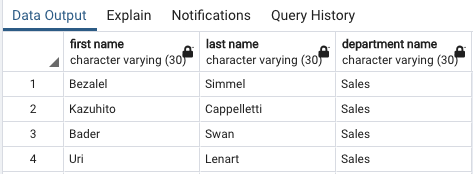

7. List all employees in the Sales and Development departments, including their employee number, last name, first name, and department name.
```
SELECT e.emp_no AS "employee number", e.first_name AS "first name", e.last_name AS "last name", d.dept_name AS "department name"
FROM employees AS e
JOIN dept_emp AS de
ON e.emp_no= de.emp_no
JOIN departments AS d
ON de.dept_no= d.dept_no
WHERE d.dept_name = 'Sales' OR d.dept_name = 'Development';
```
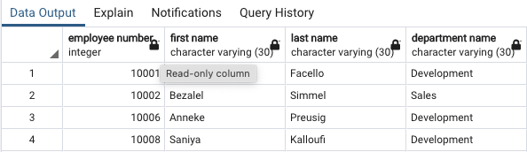

8. In descending order, list the frequency count of employee last names, i.e., how many employees share each last name.
```
SELECT last_name AS "last name", COUNT (last_name) AS "lastname count"
FROM employees
GROUP BY last_name
ORDER BY "lastname count" DESC;
```
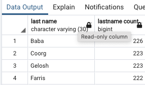

### Data Validation
The engine and connection to the database was created using `SQLalchemy` and the tables were imported and manipulated, in order to examine and validate the dataset. The analysis was conducted in `Jupyter notebook` and is linked to [data_validation.ipynb](https://github.com/KeSavanh/sql-challenge/blob/main/EmployeeSQL/data_validation.ipynb)
#### Histogram to visualize the most common salary ranges for employees
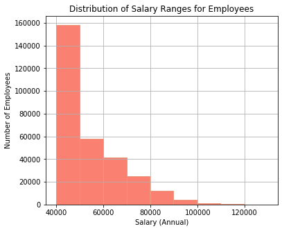
#### Bar chart of average salary by title
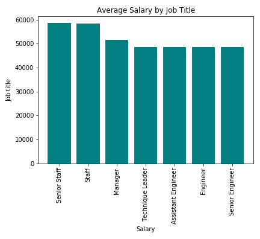
### Epilogue
The investigation was conducted by searching for ID number `499942` and could be done by two different ways. It turned out that the finding was just a joke! for April Foolsday!!

